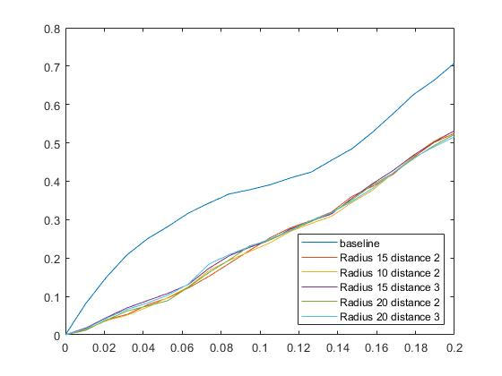
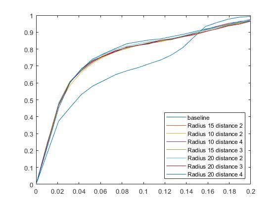

# GLU-NET-Fundamental-matrix
Relative works:
* https://github.com/PruneTruong/GLU-Net
* https://github.com/JiawangBian/FM-Bench

We used the maps of GLU-Net and used it to find a fundamental matrix in FM-Bench.

# Test your own dataset
1. Download the GLU-Net files(that related to the test files) and change the test_GLUNet.py file to the attached file.
2. Add your dataset as a folder to the main folder.
3. Run it.
4. put the results in the FM-Bench - Matches folder.
5. In Pipeline/pipeline_Demo, put in comment all the function calls except GeometryEstimation and run it.
6. Run Evaluation/Evaluate.

Dataset	| recall | inliers before rate | inliers after rate	| Threshold	| distance
--- | --- |--- |--- |--- | ---
CPC |	0.099	| 0.213729 | 0.225642	| 3 |	20
CPC | 0.101 |	0.211742 | 0.222566 | 3 | 15
CPC | 0.85 | 0.215266	| 0.226008 | 2 | 20
CPC | 0.089 | 0.216761 | 0.228251 | 2	| 15
**CPC theirs** | **0.277** | **0.480910** | **0.673079** |

Dataset	| recall | inliers before rate | inliers after rate	| Threshold	| distance
--- | --- |--- |--- |--- | ---
KITTI	| 0.894 | 0.946406 | 0.971144 | 4 | 20
KITTI	| 0.894 | 0.964502 | 0.977425 | 4 | 10
KITTI	| 0.898 |	0.948491 | 0.972625 |	3	| 20
KITTI	| 0.895	| 0.956532	| 0.97667	| 3	| 15
KITTI	| 0.892 | 0.964807 | 0.977560 | 2 | 10
KITTI	| 0.889	| 0.950389	| 0.974254 |	2 |	20
KITTI	| 0.897	| 0.957569	| 0.975031	| 2	| 15
**KITTI theirs** | **0.917** | **0.873992** | **0.979718** |

Dataset	| recall | inliers before rate | inliers after rate	| Threshold	| distance
--- | --- |--- |--- |--- | ---
TUM |	0.724 | 0.710168 | 0.744096 | 4 | 20
TUM |	0.711 | 0.726273 | 0.749638 | 4 | 10
TUM |	0.724	| 0.71075 |	0.744955 |	3 |	20
TUM | 0.72 |	0.722516 |	0.751698 |	3 |	15
TUM |	0.709 | 0.726295 | 0.751611 | 2 | 10
TUM | 0.726 |	0.711742 |	0.743882 |	2 |	20
TUM | 0.722	| 0.722569 | 0.748998 | 2	| 15
**TUM theirs** | **0.576** | **0.592074** | **0.752914** |

Dataset	| recall | inliers before rate | inliers after rate	| Threshold	| distance
--- | --- |--- |--- |--- | ---
Tanks_and_Temples |	0.402 | 0.785416 | 0.837061 |	3 |	20
Tanks_and_Temples | 0.397 | 0.78209 | 0.824114 |	3 |	15
Tanks_and_Temples | 0.381 | 0.792710 | 0.837533 |	2 |	20
Tanks_and_Temples | 0.378 | 0.793245 | 0.835997 | 2 | 15
**Tanks_and_Temples theirs** | **0.681** | **0.53279** | **0.753079** |

